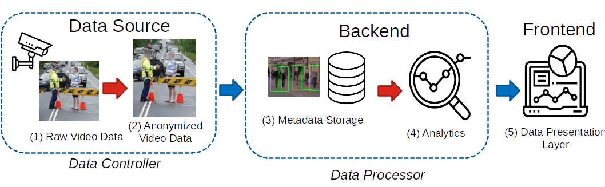

## PEOPLE (Privacy Preserving Monitoring of Social Distancing in Public Environments)

### Home

PEOPLE project developed at the Interdisciplinary Research Centre for Security, Reliability and Trust [SnT](https://wwwen.uni.lu/snt) of the [University of Luxembourg](https://wwwen.uni.lu/)
This research project will be run under the umbrella of the [360Lab](https://360lab.uni.lu/) at SnT of the University of Luxembourg. It is the first thematic research laboratory focusing on smart mobility.

### Description

PEOPLE project has been awarded an [FNR](https://www.fnr.lu/research-luxembourg-results-fnr-covid-19-call/) grant to fund work on this expedited and urgent project during six months 06-12/2020.

The aim of this project is to provide a platform to run a comprehensive analysis on the Social Distancing measures decided by the government in the context of the COVID-19 pandemic. To do so we propose to analyse anonymised video data in the city of Luxembourg. The first step will be to anonymise the video feed by using well known Artificial Intelligence (AI) models (face blurring). In a next step will use other AI models to identify pedestrians and groups of individuals, calculate their relative distances and overall density. Those metrics can then be evaluated over time for different locations and provide valuable insights on the greater or lesser risks of infection spreading based on behaviour. The rules can be used either to inform where the police need to focus their efforts in enforcing rules, or to inform and influence the public’s actions (or both).

### Method

### Results

### Contact

* Raphaël FRANK, raphael.frank [ at ] uni.lu
* Sofiane LAGRAA, sofiane.lagraa [ at ] uni.lu
